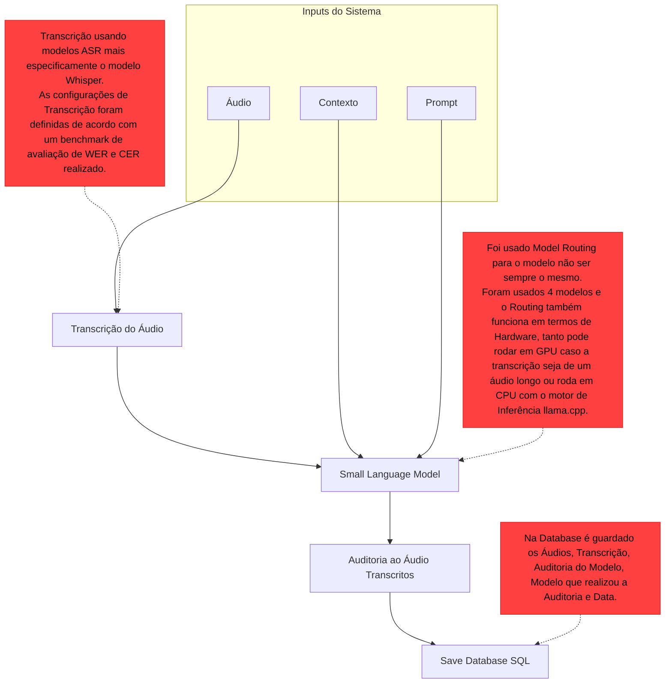

<h1> Resultados dos Benchmarks </h1>

    

    

    

<h1> Assobio - Auditoria </h1>

```mermaid
flowchart TD
    subgraph INPUTS["Inputs do Sistema"]
        direction TD
        AUDIO[Áudio]
        CONTEXTO[Contexto]
        PROMPT[Prompt]
    end

    AUDIO --> TRANSCRIPTION[Transcrição do Áudio]
    TRANSCRIPTION --> SLM[Small Language Model]
    CONTEXTO --> SLM
    PROMPT --> SLM

    SLM --> AUDITORIA[Auditoria ao Áudio Transcritos]

    AUDITORIA --> SAVE[Save Database SQL]

    NOTE["Transcrição usando modelos ASR mais especificamente o modelo Whisper.\nAs configurações de Transcrição foram definidas de acordo com um benchmark de avaliação de WER e CER realizado."]
    NOTE -.-> TRANSCRIPTION

    NOTE2["Foi usado Model Routing para o modelo não ser sempre o mesmo.\nForam usados 4 modelos e o Routing também funciona em termos de Hardware, tanto pode rodar em GPU caso a transcrição seja de um áudio longo ou roda em CPU com o motor de Inferência llama.cpp."]
    NOTE2 -.-> SLM

    NOTE3["Na Database é guardado os Áudios, Transcrição, Auditoria do Modelo, Modelo que realizou a Auditoria e Data."]
    NOTE3 -.-> SAVE

    style NOTE fill:#ff4040 , stroke:#e62020, color:#000000 
    style NOTE2 fill:#ff4040 , stroke:#e62020, color:#000000
    style NOTE3 fill:#ff4040 , stroke:#e62020, color:#000000
```

<h1> Assobio - Chat </h1>
